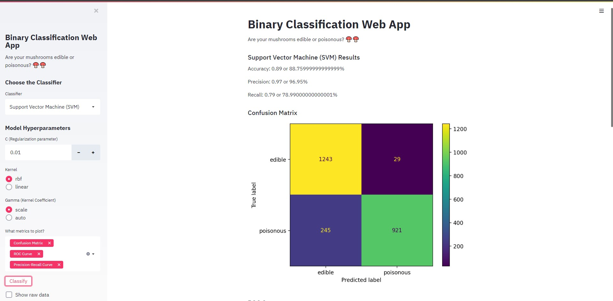
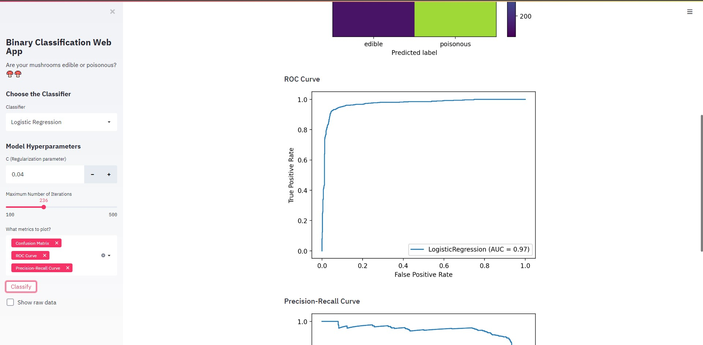
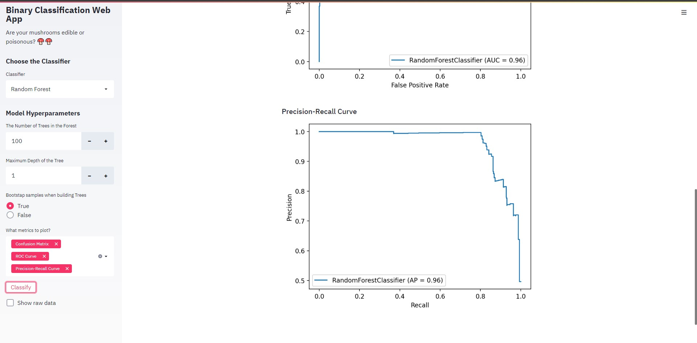
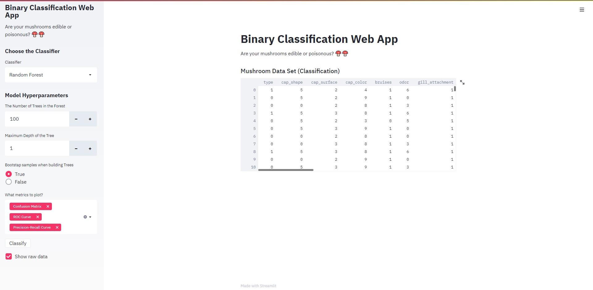

# Mushroom-Classification-Web-App

[](http://hits.dwyl.com/swapnanildutta/Mushroom-Classification-Web-App)

This web application will allows users to choose what classification algorithm they want to use and let them interactively set hyper-parameter values, all without them knowing to code! The user can to load, explore, visualize and interact with data, and generate dashboards.

## Concepts used

#### Logistic Regression

`Logistic regression is the appropriate regression analysis to conduct when the dependent variable is dichotomous (binary). Like all regression analyses, logistic regression is a predictive analysis. Logistic regression is used to describe data and to explain the relationship between one dependent binary variable and one or more nominal, ordinal, interval, or ratio-level independent variables.`

#### Random Forest Classifier

`Random forest is a supervised learning algorithm which is used for both classification as well as regression. But however, it is mainly used for classification problems. As we know that a forest is made up of trees and more trees means more robust forest. Similarly, random forest algorithm creates decision trees on data samples and then gets the prediction from each of them and finally selects the best solution by means of voting. It is an ensemble method which is better than a single decision tree because it reduces the over-fitting by averaging the result.`

#### Support Vector Machine (SVM)

`Support Vector Machine (SVM) is a relatively simple Supervised Machine Learning Algorithm used for classification and/or regression. It is more preferred for classification but is sometimes very useful for regression as well. Basically, SVM finds a hyper-plane that creates a boundary between the types of data. In 2-dimensional space, this hyper-plane is nothing but a line. In SVM, we plot each data item in the dataset in an N-dimensional space, where N is the number of features/attributes in the data. Next, find the optimal hyperplane to separate the data. So by this, you must have understood that inherently, SVM can only perform binary classification (i.e., choose between two classes). However, there are various techniques to use for multi-class problems.`

## How to use

### Locally :

- Fork this repository and download using _git clone_.
  ```bash
  $git clone https://github.com/<username>/Mushroom-Classification-Web-App.git
  ```
- Install all the dependencies.
  ```powershell
  $pip install -r requirements.txt
  ```
  or,
  ```bash
  $pip3 install -r requirements.txt
  ```
- And, finally run the [app.py](app.py) file.
  ```bash
  $streamlit run app.py
  ```

### Remotely :

- Fork the repository and make necessary changes.
- Connect the web app to the repository.

### Final Outcomes :

<p align="center">
    
    
    
    
<p>
